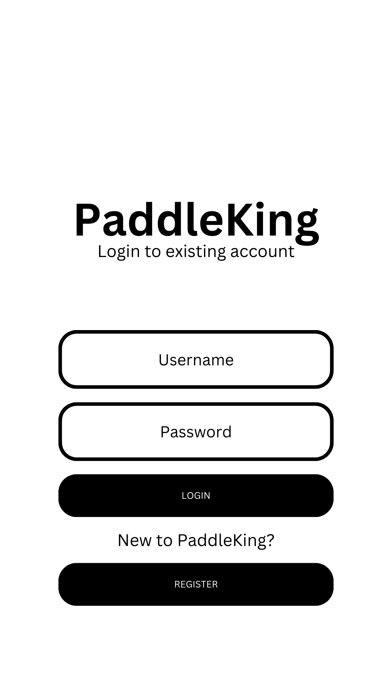
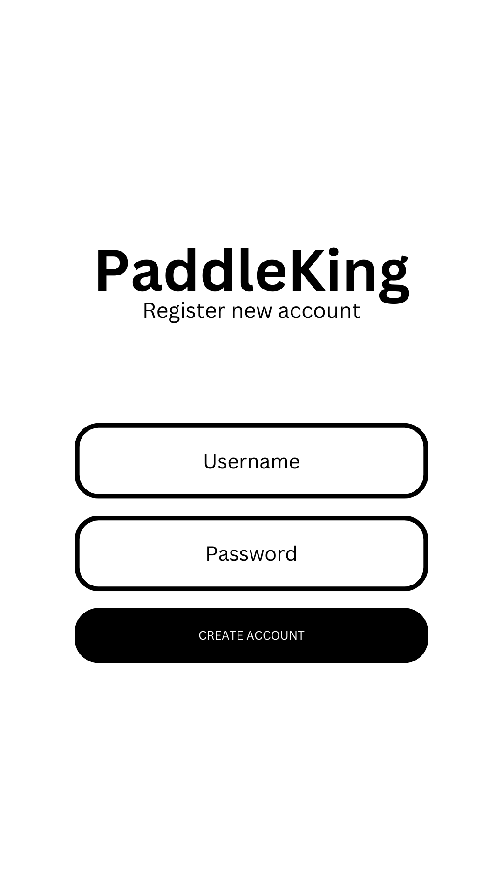
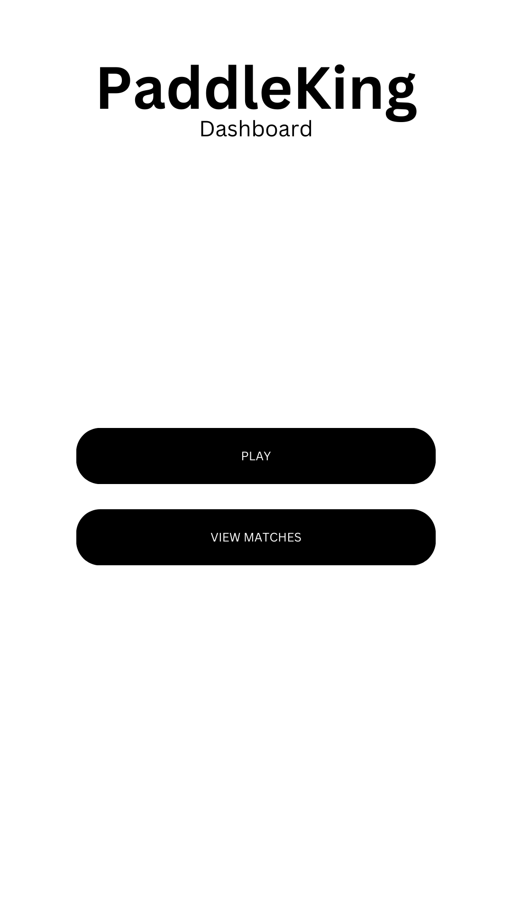
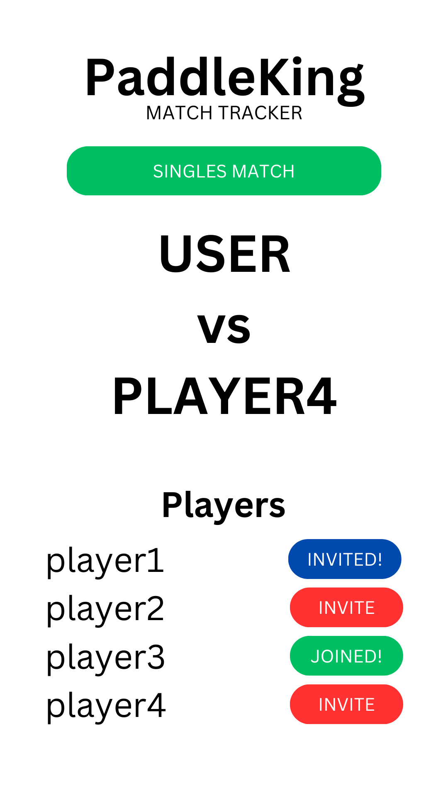
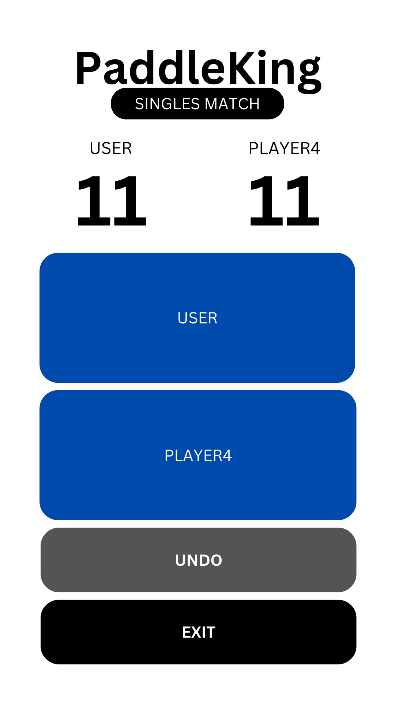
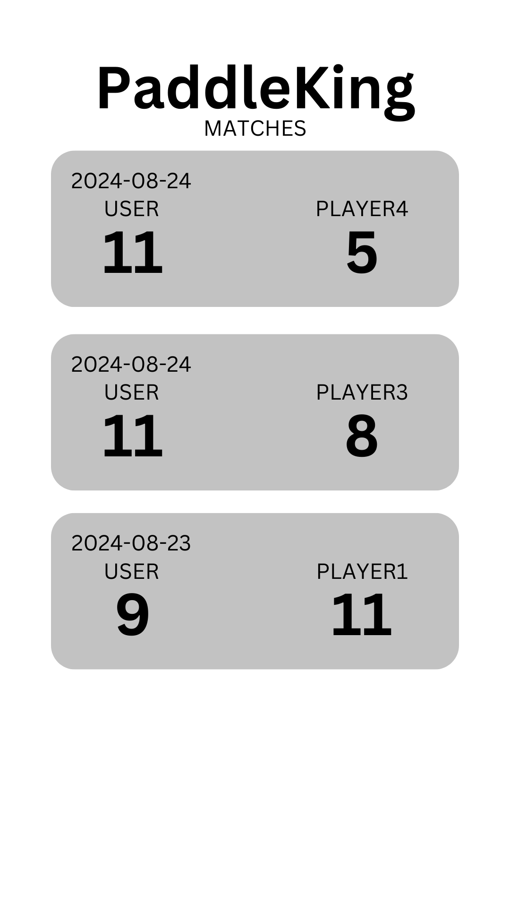

# PaddleKing

## Specification Deliverable
An app like Chess.com but for Pickleball and Tennis. A low key version of an app that I am sure already exists but for the casual pickleball player who wants some level of tracking for their game.

### Pitch
PaddleKing is the opportunity for you to gamify and track the hours you spend playing pickleball with your friends. Easily track your competitive rankings, see how you stack up with your friends, challenge your nemesis to a 1v1 and much more. Rise to the top with PaddleKing.

### Key Features
- Login and registration for new users
- secure logins with passwords stored as hashed values
- Track matches with other players
- View match history
- Accept and decline requests to participate in live matches in real-time
- users can create friendships with other players

### Technologies
I will use all the required technologies in the following ways. Some of these may evolve over the course of development.
- **HTML** - Uses organized, easy to read HTML. Has 5 pages: login, homepage, match-tracking page, results page, match list page
- **CSS** - Styling and animating pages, supports dark mode to save the eyeballs of the innocent, 
- **JavaScript** - provides login, registration, buttons to start matches and view match history, backend endpoint calls, retrieval of data from database using asynchronous functions
- **React** - Handle routing, create interactive UI elements for specifying which kind of match a user is creating, makes for reactive and fun match tracking page with reactive UI elements
- **Web Service**
	- sendFriendRequest (sends a friend request to another user)
	- saveMatch (saves the score)
	- calculateNewELO (based on the match that you tracked, it calculates the new ELO for both players)
	- login
	- register
	- getMatches
- **Authentication** - Input to let users create an account and login. Display user details after they login.
- **Database Data** - Save match logs so that users can see how they performed
- **WebSocket Data** - receiving matchmaking requests in real-time

### Design
Login

Register

Homepage

Match Setup

Match Tracking

Matches List View

## HTML Deliverable
- [ ] add login html elements
- [ ] add navigation for homepage --> match setup and homepage --> match list
- [ ] match setup
	- [ ] placeholder for list of friends / list of users
	- [ ] start button
- [ ] match tracking
	- [ ] placeholder for scores
	- [ ] buttons for player1 and player2
	- [ ] undo button
	- [ ] exit button
- [ ] match list
	- [ ] placeholder for list of matches

## CSS Deliverable
- [ ] Add favicon.ico 

## React Deliverable

## Service Deliverable

## DB/Login Deliverable

## WebSocket Deliverable